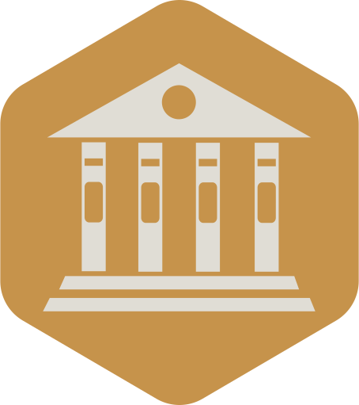

<a name="readme-top"></a>

<div align="center">
  
  <br/>

  <h3><b>SCHOOL LIBRARY</b></h3>

</div>

# 📗 Table of Contents

- [📖 About the Project](#about-project)
  - [🛠 Built With](#built-with)
    - [Tech Stack](#tech-stack)
    - [Key Features](#key-features)
- [💻 Getting Started](#getting-started)
  - [Setup](#setup)
  - [Prerequisites](#prerequisites)
  - [Install](#install)
  - [Usage](#usage)
- [👥 Authors](#authors)
- [🔭 Future Features](#future-features)
- [🤝 Contributing](#contributing)
- [⭐️ Show your support](#support)
- [🙏 Acknowledgements](#acknowledgements)
- [📝 License](#license)

# 📖 School Library <a name="about-project"></a>

**School Library** is an app let librarians record what books are in the library and who borrows them.

## 🛠 Built With <a name="built-with"></a>

### Tech Stack <a name="tech-stack"></a>

This project was implemented using:

<details>
  <summary>Client</summary>
  <ul>
    <li><a href="https://www.ruby-lang.org/en/documentation/">Ruby</a></li>
  </ul>
</details>

<p align="right">(<a href="#readme-top">back to top</a>)</p>

### Key Features <a name="key-features"></a>

At the moment you can:

- **Create Person objects from Person class**
- **Create Student objects from Student class**
- **Create Teacher object from Teacher class**

<p align="right">(<a href="#readme-top">back to top</a>)</p>

## 💻 Getting Started <a name="getting-started"></a>

To get a local copy up and running, follow these steps.

### Prerequisites <a name="prerequisites"></a>

In order to run this project you need to have installed:

- [ ] You’ll need to have Ruby on your machine.

Optionally, in order to modify this project you should to have installed:

- [ ] Git.

- [ ] Code editor like: [Visual Studio code](https://code.visualstudio.com/), [Sublime text](https://www.sublimetext.com/) or others...

### Setup <a name="setup"></a>

To clone this repository to your desired folder:

- You can download the **Zip** file from the GitHub repository, or clone the repository with:

```console
git clone https://github.com/paulsaenzsucre/school-library.git
```

- Access the cloned directory with:

```console
cd school-library
```

- Open it with your favorite code editor

### Usage <a name="usage"></a>

To run the project, execute the following command in irb:

```irb
p = Person.new(25)
q = Student.new(34, 'Maths')
```
## 👥 Authors <a name="authors"></a>

👤 **Paul Sáenz Sucre**

- GitHub: [@paulsaenzsucre](https://github.com/paulsaenzsucre)
- Twitter: [@paulsaenzsucre](https://twitter.com/paulsaenzsucre)
- LinkedIn: [@paulsaenzsucre](https://www.linkedin.com/in/paulsaenzsucre)

<p align="right">(<a href="#readme-top">back to top</a>)</p>

## 🔭 Future Features <a name="future-features"></a>

We will implement this on future iterations:

- [ ] **Add new students or teachers.**
- [ ] **Add new books.**
- [ ] **Save records of who borrowed a given book and when.**

<p align="right">(<a href="#readme-top">back to top</a>)</p>

## 🤝 Contributing <a name="contributing"></a>

Contributions, issues, and feature requests are welcome!

Feel free to check the [issues page](../../issues/).

<p align="right">(<a href="#readme-top">back to top</a>)</p>

## ⭐️ Show your support <a name="support"></a>

Give a ⭐️ if you like this project!

<p align="right">(<a href="#readme-top">back to top</a>)</p>

## 🙏 Acknowledgments <a name="acknowledgements"></a>

- Hat tip to anyone whose code was used.
- Thanks for all the curated content that was provided to us.
- Thanks to my learning and coding partners for all their support.

<p align="right">(<a href="#readme-top">back to top</a>)</p>

## 📝 License <a name="license"></a>

This project is [MIT](./LICENSE) licensed.

<p align="right">(<a href="#readme-top">back to top</a>)</p>